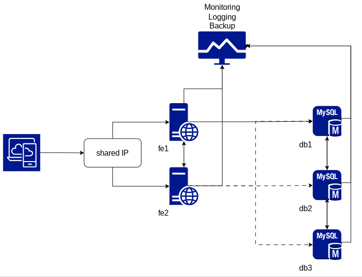

# Проектная работа

Создание высокодоступной и отказоустойчивой инфраструктуры с централизованным резервным копированием, логированием и мониторингом с алертингом.

## Описание

Стенд проекта состоит из шести ВМ: 2 фронтенда (fe1, fe2), 3 БД (db1, db2, db3), ВМ для логов, бекапов и мониторинга с алертингом (bkplog).
После запуска ВМ с помощью ansible-playbook получаем развернутый wordpress в отказоустойчивой конфигурации, доступный по адресу http://192.168.1.90.
SeLinux и firewalld включены.

## Схема



## Адресация

- 192.168.1.90  keepalived IP
- 192.168.1.92	bkplog
- 192.168.1.93	fe1
- 192.168.1.94	fe2
- 192.168.1.95	db1
- 192.168.1.96	db2
- 192.168.1.97	db3

## Предварительная настройка

- В Vagrantfile следует указать сетевой интерфейс хоста, с которым необходимо создать bridge в ВМ (в проекте используется eth1).
- Изменить IP адреса во всем проекте (поиском и заменой) на свои локальные, свободные (включая 192.168.1.90 - адрес для keepalived).

## Запуск

```bash
vagrant up
```

## Фронтенды

На frontend нодах используются следующие технологии: nginx, php-fpm, keepalived, lsyncd, mysql-router.  


Между двумя ВМ с фронтендами общий адрес 192.168.1.90 (обеспечивается keepalived). 
Директория с wordpress (/var/www/html/wordpress) между фронтенд нодами синхронизируется с помощью lsyncd. 
Подключение к БД осуществляется через mysql-router, установленный на каждой ВМ фронтенда и балансирующий запросы к серверам БД по round-robin.

## База данных

На ВМ db1, db2, db3 разворачивается Mysql Multi-Primary Group Replication.  
Для того, чтобы ansible-роль была идемпотентна в файлах host_vars/db*.yml есть параметр mysql_init. При первичной настройке он должен быть true. После завершения настройки кластера его необходимо переключить в false, чтобы при повторном запуске ansible-playbook не произошла переинициализация хостов. 
Также после успешной первичной настройки необходимо добавить параметр `mysql_gr_start_on_boot: "on"` в файлы переменных host_vars/db*.yml и запустить `ansible-playbook provisioning/playbook.yml --tags mysql-set-config-wor`. Необходимо это для того, чтобы при перезапуске ноды, она автоматически присоединялась к mgr. Если оставить off, то после перезапуска ноды необходимо будет запустить репликацию вручную:

```bash
vagrant ssh db2
sudo -i
mysql -u root
START GROUP_REPLICATION;
```

Проверка кластера:

```bash
$ vagrant ssh db1
[vagrant@db1 ~]$ sudo -i
[root@db1 ~]# mysql -u root

mysql> SELECT * FROM performance_schema.replication_group_members;
+---------------------------+--------------------------------------+-------------+-------------+--------------+-------------+----------------+----------------------------+
| CHANNEL_NAME              | MEMBER_ID                            | MEMBER_HOST | MEMBER_PORT | MEMBER_STATE | MEMBER_ROLE | MEMBER_VERSION | MEMBER_COMMUNICATION_STACK |
+---------------------------+--------------------------------------+-------------+-------------+--------------+-------------+----------------+----------------------------+
| group_replication_applier | 53242613-2ca2-11ee-a468-5254004d77d3 | db3         |        3306 | ONLINE       | PRIMARY     | 8.0.34         | XCom                       |
| group_replication_applier | 5324a2cd-2ca2-11ee-a2b1-5254004d77d3 | db2         |        3306 | ONLINE       | PRIMARY     | 8.0.34         | XCom                       |
| group_replication_applier | def8b96e-2ca1-11ee-a2df-5254004d77d3 | db1         |        3306 | ONLINE       | PRIMARY     | 8.0.34         | XCom                       |
+---------------------------+--------------------------------------+-------------+-------------+--------------+-------------+----------------+----------------------------+
3 rows in set (0.05 sec)
```

## Резервное копирование

На ВМ fe1 каталог с файлами сайта упаковывается в архив /home/bkp/wp.tar.gz.
На ВМ db1 сохраняется дамп БД wordpress c помощью mysqldump в /home/bkp/wp.sql.
На ВМ bkplog через scp эти файлы по крону копируются в /home/bkp.
Файл заданий cron находится в /etc/cron.d/wp-cron.

## Логирование:

Все логи собираются на ВМ bkplog в /var/log/remote.

## Мониторинг с алертингом

На ВМ bkplog установлен Prometheus + Grafana + alerting. На каждой ВМ установлен node_exporter.


В случае, если какая-либо из ВМ будет недоступна в течение 30 секунд, в канал Slack будет отправлен алерт.


